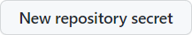

# Gradescope iCalendar Integration

All credit goes to [@tanjeffreyz](https://github.com/tanjeffreyz) for developing the web scraping service and most of the README. Also, [@zyonse](https://github.com/zyonse) has a similar program that you can find [here](https://github.com/tanjeffreyz/planit/pull/2). I don't know if it works.

Because some online homework platforms such as Gradescope don't have an API for students (boo👎), web scraping is required to retrieve 
information about assignments. **HTTP requests** are used alongside **Beautiful Soup** to perform this web scraping, 
which is automatically executed every 6 hours (starting at 12am EST) using **GitHub Actions**. This time can be edited by changing the [cron value](https://docs.github.com/en/actions/using-workflows/events-that-trigger-workflows#schedule) in main.yml. This will create an ics file which you can add to any major calendar service. The program will not add any completed assignments, as well as any assignments older than 180 days. Let me know if you want to be able to change this value.


## One-time Setup Instructions
1. Log into GitHub or <a href="https://github.com/join"><b>create a new GitHub account</b></a> if you don't have one.

2. Click <a href="#"></a> at the top of this page, 
which should open the following prompt.
<div align="center">
    
</div>

3. Enter a name for the new repository. <b>You will need to set it to public.</b> This is the only way that your calendar can access the data. All calendar links are public and work this way.
Then, click <b>Create Repository</b>.

4. Visit your new repository's secrets at the following link:
```
https://github.com/YOUR_USERNAME/REPOSITORY_NAME/settings/secrets/actions
```

## Configuration
5. For each homework platform you use, create **two** new 
<a href="https://docs.github.com/en/actions/security-guides/encrypted-secrets">GitHub secrets</a>: 
one for your **username** and one for your **password**. A new secret can be created by clicking 
<a href="#"></a>. 
<b>For each secret's "Name" field, you must only use the values listed below.
In the "Secret" field, enter either your username or password depending on the value you chose for the "Name" field.</b>

<table align="center">
    <tr><th align="center">Username</th><th align="center">Password</th></tr>
    <tr align="center"><td>GRADESCOPE_USER</td><td>GRADESCOPE_PASSWORD</td></tr>
</table>

6. Now, go to the following link:

```
https://github.com/YOUR_USERNAME/REPOSITORY_NAME/settings/actions
```

7. Under "Workflow Permissions", make sure that "Read and write permissions" is enabled:
<div align="center">
    
</div>

## Starting the program
Using the file navigation in your repository's home page, go to `data/assignments.json`, **delete** the file, and click 
<a href="#"></a>.
This will force the program to regenerate your calendar.

This only needs to be done once, then the program should automatically update.

## Adding the assignments to your calendar
There are 3 different ways you can add this to your calendar. 
### Option 1: Manual
The file is located at `data/assignments.ics`. Simply download it and import it to your calendar. This will not automatically update. However, if you do use this option, **you can set the repository to be private**. 

### Option 2: URL
The file is located at `data/assignments.ics`. On the top right, click the raw buttom. This will open the raw data. Then you can paste this url into the "import from URL" option in your calendar. 

### Option 3: URL with forced refresh (Google Calendar Only)
Google calendar can refresh slowly sometimes, but if you want to force it to refresh at a different rate you can use this script: https://script.google.com/home/projects/1BOk8MDLbLaHh6SwG1M1tsgNXjkcC-79LE0QoipRuTDxbO3fMVvqoROQD/edit

## That's it!
Your calendar should retreive the gradescope assignments and automatically add them to your calendar. 
<br>
